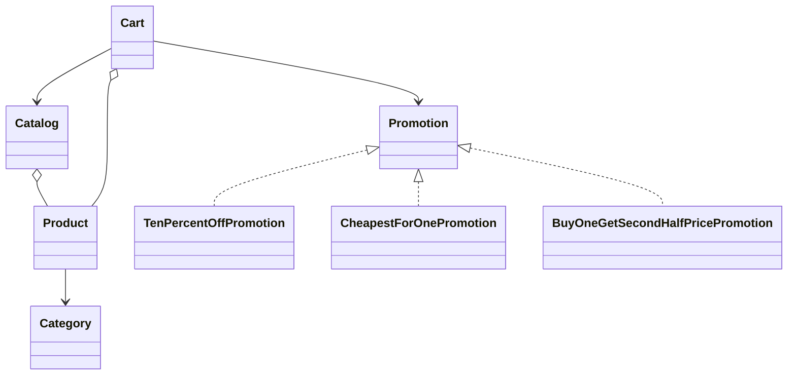
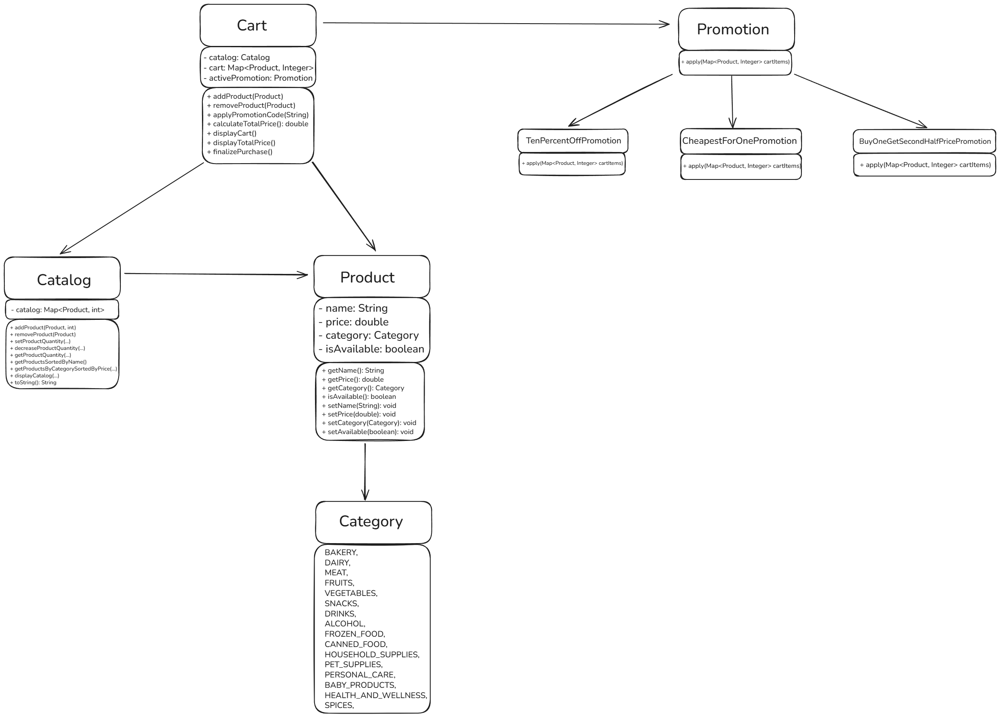

# E-commerce Domain Demo

[](https://openjdk.org/)
[](https://github.com/poprostuadam/e-commerce_backend/actions/workflows/java-ci.yml)
[](https://junit.org/junit5/)
[](LICENSE)

A framework-free Java console application demonstrating the core domain logic of a small online supermarket. It models products, inventory, a shopping cart, and interchangeable discount strategies, with JUnit 5 tests covering the main business rules.

> This repository contains a domain-layer and console demonstration. It is not an HTTP backend and does not include a web framework, database, authentication, or external services.

## Features

- product name, price, category, and availability,
- inventory quantities stored in a product catalog,
- alphabetical catalog sorting,
- category filtering with price and availability options,
- adding repeated products to a shopping cart,
- returning removed cart items to inventory,
- automatic stock and availability updates,
- cart totals before and after discounts,
- purchase finalization and cart reset,
- promotion strategies selected by code,
- unit tests written in a Given–When–Then style.

## Promotions

Only one promotion is active at a time. Applying another valid promotion replaces the previous strategy.

| Code | Rule |
| --- | --- |
| `PROMO10` | Reduces the complete cart total by 10%. |
| `BUY2HALF` | Applies a 50% discount to the second item in every pair of identical products. |
| `CHEAPEST1PLN` | For every three cart items, reduces an eligible cheapest item to PLN 1. |

Blank promotion codes clear the active promotion. Invalid codes leave the current promotion unchanged.

## Design



The promotion classes implement the Strategy pattern: `Cart` depends on the `Promotion` interface and delegates discount calculation to the selected implementation.

A detailed class diagram is also included in the repository:



## Project structure

```text
.
├── .github/workflows/java-ci.yml
├── Diagram.png
├── LICENSE
├── README.md
└── ecommerce-backend/
    ├── .mvn/wrapper/maven-wrapper.properties
    ├── pom.xml
    ├── mvnw
    ├── mvnw.cmd
    ├── src/
    │   ├── Main.java
    │   ├── Model/
    │   └── Promotion/
    └── test/
        ├── Model/
        └── Promotion/
```

## Requirements

- JDK 17 or newer,
- an internet connection on the first build so Maven Wrapper can download Maven and dependencies.

A separate Maven installation is not required.

## Build and run

Clone the repository and enter the Java project directory:

```bash
git clone https://github.com/poprostuadam/e-commerce_backend.git
cd e-commerce_backend/ecommerce-backend
```

Build the project and run all tests:

```bash
sh ./mvnw clean verify
```

Run the console demonstration:

```bash
java -cp target/classes Main
```

On Windows, use `mvnw.cmd clean verify` instead of the shell command.

## Tests

Tests are located in `ecommerce-backend/test/` and use JUnit 5:

- `ProductTest` — product construction and state,
- `CatalogTest` — inventory, filtering, and sorting,
- `CartTest` — cart operations and totals,
- `PromotionTest` — discount calculations.

Run only the test suite with:

```bash
sh ./mvnw test
```

GitHub Actions automatically runs `verify` for every pull request and every push to `main`.

## Current scope and limitations

- Prices use `double`; production financial calculations should use `BigDecimal`.
- State is held in memory and is lost after the program exits.
- Products are compared by name and category.
- Promotion codes are hardcoded in `Cart`.
- The project has no API, persistence, validation layer, or concurrent stock handling.
- Maven is configured for the existing non-standard `src/` and `test/` layout.

## Roadmap

- reorganize sources into the conventional `src/main/java` and `src/test/java` layout,
- use `BigDecimal` and an explicit currency type,
- separate console output from domain logic,
- expose the domain through a REST API,
- add persistence and transactional inventory updates.

## License

This project is available under the [MIT License](LICENSE).
